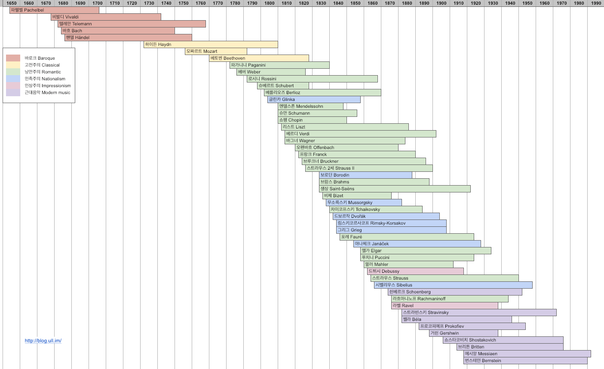

# Classical Music

클래식 음악 정리 - 해당 음악 정리표 참고

## Baroque 바로크

[Baroque](01-baroque/README.md)

* [Vialdi](01-baroque/01-vivaldi.md)
* [Bach](01-baroque/02-bach.md)

## Classical 고전주의

[Classical](02-classical/README.md)

* [Mozart](02-classical/01-mozart.md)
* [Beethoven](02-classical/02-beethoven.md)

## Romantic 낭만주의

[Romantic](03-romantic/README.md)

* [Paganini](03-romantic/01-paganini.md)
* [Schubert](03-romantic/02-schubert.md)
* [Mendelssohn](03-romantic/03-mendelssohn.md)
* [Schumann](03-romantic/04-schumann.md)
* [Chopin](03-romantic/05-chopin.md)
* [Liszt](03-romantic/06-liszt.md)
* [Strauss II](03-romantic/07-strauss-ii.md)
* [Brahms](03-romantic/08-brahms.md)
* [Saint-saens](03-romantic/09-saint-saens.md)
* [Tchaikovsky](03-romantic/10-tchaikovsky.md)
* [Elgar](03-romantic/11-elgar.md)
* [Mahler](03-romantic/12-mahler.md)

## Nationalism 민족주의

## Impression 인상주의

[Impression](05-impression/README.md)

* [Debussy](05-impression/01-debussy.md)
* [Ravel](05-impression/02-ravel.md)

## Modern Music 근대음악

[Modern Music](06-modern-music/README.md)

* [Stravinsky](06-modern-music/01-stravinsky.md)
* [Prokofiev](06-modern-music/02-prokofiev.md)
* [Shostakovich](06-modern-music/03-shostakovich.md)
